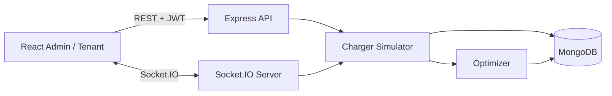

# RouteGuardian — Multi-Tenant EV Charging Optimizer

> **Single source of truth.** This is the only `README.md` in the repository. Update it whenever features, APIs, schemas, folders, components, env vars, or dependencies change.

---

# Project Overview

## Description

**RouteGuardian** is a full-stack, multi-tenant EV charging management platform built for the LBRCE FSD Hackathon. Platform admins configure sites, chargers, tenants, and grid capacity. Tenant managers register fleets (vehicles/drivers), simulate plug-ins, and watch charging sessions move live across a shared session board while a lightweight optimizer fairly allocates limited site power.

## Problem Statement

Depot and workplace charging sites have a hard electrical capacity limit. When many vehicles plug in at once, unmanaged charging can trip breakers or leave high-priority / soon-to-depart vehicles undercharged. Tenants need visibility into sessions, fair allocation, usage billing, and timely alerts when plans change — without a real OCPP stack in a hackathon timeframe.

## Solution Approach

1. **Role-based portals** — Google OAuth (or hackathon demo login) issues a JWT with `admin` / `tenant_manager` roles; tenant data is scoped from the verified JWT (never from client-supplied `tenantId`).
2. **Charger simulator** — `setInterval`-driven state machine per session (Queued → Connected → Charging → Optimized → Throttled → Completed).
3. **Greedy optimizer** — explainable scoring (urgency × priority × tariff) that allocates power until site capacity is exhausted.
4. **Realtime board** — Socket.IO broadcasts `session:update` / `site:update` / `notification:new` to tenant and admin rooms.
5. **Metered billing + simulated push** — completed sessions append to open invoices; throttle/complete events create in-app notifications.

---

# Features

| Area | Capabilities |
|------|----------------|
| **Public landing** | Premium `/` page: hero, animated EV illustration, features, how-it-works, optimizer explainer, stats, dashboard preview, pricing, testimonials, footer |
| **Authentication** | Google OAuth (`GET /auth/google`, `POST /auth/google/callback`); JWT stores `userId`, `email`, `name`, `picture`, `role`, `tenantId`; `GET /auth/me`, `POST /auth/logout`; demo-role login when `ALLOW_DEMO_AUTH=true` |
| **Tenant management** | Admin onboards companies (`companyName`, `billingPlan`, `siteId`) |
| **Site & charger management** | Sites with `maxCapacityKw`; chargers with status `available` / `in_use` / `offline` |
| **Fleet (vehicles)** | Tenant-scoped CRUD: driver, battery kWh, `priorityTier`, `departureTime` |
| **Optimization engine** | Pure `allocatePower()` — urgency, SLA/High/Medium/Low weights, peak tariff factor, throttle threshold |
| **Session board** | Live kanban columns; Simulate Plug-In; stop session; connection-lost banner |
| **Billing** | Open monthly invoice per tenant; `kWh × tariffRate`; admin reports / tenant billing panel |
| **Notifications** | Persisted alerts on Throttled / Completed; bell unread count; toast (“simulated push/SMS”) |
| **Judge dashboard** | Admin analytics with animated counters: sessions, energy, chargers, grid %, tariff, tenants, vehicles + Recharts |
| **UI polish** | Mobile-first (360–1440), glassmorphism, Framer Motion, class-based dark/light toggle (`@custom-variant dark`), skeletons, empty/error/success states |

---

# Tech Stack

### Frontend

| Package | Role |
|---------|------|
| React 19 | UI |
| Vite 8 | Dev server / build |
| Tailwind CSS 4 | Mobile-first (`xs:360`, `md:768`, `lg:1024`, `xl:1440`) |
| React Router 7 | Public landing + role-based portals |
| Axios | REST client (Bearer JWT) |
| Socket.IO Client | Live sessions, power samples, notifications |
| Recharts | Power usage & cost charts |
| Framer Motion | Landing + counter / hover motion |
| `@react-oauth/google` | Google Identity Services button |
| Syne + Manrope | Display / body typography |

### Backend

| Package | Role |
|---------|------|
| Node.js | Runtime |
| Express 5 | HTTP API |
| Mongoose 9 | MongoDB ODM |
| Socket.IO 4 | Realtime rooms |
| jsonwebtoken | Session JWT after Google verify |
| google-auth-library | Verify Google ID tokens |
| dotenv / cors / nodemon | Config, CORS, dev reload |

### Infrastructure

- MongoDB (local or Atlas)
- Concurrently (root `npm run dev`)

---

# Folder Structure

```text
LBRCE_FSD_HACKTHON/
├── README.md                 ← ONLY markdown doc in the repo
├── package.json              ← root scripts (dev, seed, build, start for Render)
├── render.yaml               ← Render Web Service blueprint (not Static Site)
├── .gitignore
├── backend/
│   ├── package.json
│   ├── nodemon.json
│   ├── .env                  ← local secrets (not committed)
│   ├── .env.example
│   ├── server.js             ← HTTP + Socket.IO bootstrap
│   ├── app.js                ← Express middleware & /api mount
│   ├── config/
│   │   ├── db.js
│   │   └── env.js
│   ├── middleware/
│   │   ├── auth.middleware.js
│   │   └── tenant.middleware.js
│   ├── models/
│   │   ├── User.js
│   │   ├── Tenant.js
│   │   ├── Site.js
│   │   ├── Charger.js
│   │   ├── Vehicle.js
│   │   ├── Session.js
│   │   ├── Invoice.js
│   │   └── Notification.js
│   ├── routes/
│   │   ├── index.js
│   │   ├── health.routes.js
│   │   ├── auth.routes.js
│   │   ├── sites.routes.js
│   │   ├── chargers.routes.js
│   │   ├── tenants.routes.js
│   │   ├── vehicles.routes.js
│   │   ├── sessions.routes.js
│   │   ├── billing.routes.js
│   │   ├── notifications.routes.js
│   │   └── dashboard.routes.js
│   ├── controllers/          ← one controller per resource
│   ├── services/
│   │   ├── chargerSimulator.service.js
│   │   ├── optimizer.service.js
│   │   ├── optimizer.service.test.js
│   │   ├── tariff.service.js
│   │   ├── billing.service.js
│   │   ├── notification.service.js
│   │   ├── metrics.service.js
│   │   └── googleAuth.service.js
│   ├── sockets/
│   │   ├── index.js
│   │   └── session.socket.js
│   └── scripts/
│       └── seed.js
└── frontend/
    ├── package.json
    ├── vite.config.js
    ├── index.html
    ├── .env
    └── src/
        ├── main.jsx
        ├── App.jsx
        ├── index.css
        ├── context/
        │   ├── AuthContext.jsx
        │   ├── ThemeContext.jsx
        │   └── ToastContext.jsx
        ├── hooks/
        │   └── useNotifications.js
        ├── lib/
        │   ├── axios.js
        │   ├── socket.js
        │   ├── authToken.js
        │   └── money.js
        ├── layouts/
        │   └── AppLayout.jsx
        ├── routes/
        │   └── ProtectedRoute.jsx
        ├── pages/
        │   ├── Landing.jsx          ← public marketing page at `/`
        │   ├── Login.jsx            ← Google / demo sign-in
        │   ├── admin/
        │   │   ├── AdminDashboard.jsx  ← Judge Analytics
        │   │   ├── SitesPanel.jsx
        │   │   ├── ChargersPanel.jsx
        │   │   ├── TenantsPanel.jsx
        │   │   └── ReportsPanel.jsx
        │   ├── tenant/
        │   │   ├── TenantDashboard.jsx
        │   │   ├── VehiclesPanel.jsx
        │   │   └── BillingPanel.jsx
        │   └── shared/
        │       └── SessionBoard.jsx
        └── components/
            ├── landing/
            │   └── ChargingIllustration.jsx
            ├── charts/
            │   ├── PowerUsageChart.jsx
            │   └── TenantCostChart.jsx
            ├── forms/
            │   ├── SiteForm.jsx
            │   ├── ChargerForm.jsx
            │   ├── TenantForm.jsx
            │   └── VehicleForm.jsx
            ├── GoogleSignIn.jsx, ProfileDropdown.jsx, AnimatedCounter.jsx
            ├── Sidebar.jsx, Topbar.jsx, ThemeToggle.jsx
            ├── SessionCard.jsx, StateColumn.jsx, PlugInButton.jsx
            ├── NotificationBell.jsx, NotificationList.jsx, NotificationToast.jsx
            ├── InvoiceCard.jsx, UsageSummary.jsx, PriorityBadge.jsx
            ├── EntityTable.jsx, Modal.jsx, EmptyState.jsx
            ├── ErrorState.jsx, SkeletonCard.jsx, ConnectionStatusBanner.jsx
            └── …
```

---

# Architecture

```text
+----------------+      REST + JWT       +---------------------+
|  React (Vite)  | -------------------> |   Express API        |
| Admin / Tenant | <------------------- | (routes/controllers) |
|  Dashboards    |                       +----------+----------+
|                |        Socket.IO                  |
|                | <=======================>  Socket.IO Server
+----------------+                                   |
                                                     v
                                       +----------------------------+
                                       | Charger Simulator Service  |
                                       | (state machine / session)  |
                                       +-------------+--------------+
                                                     v
                                       +----------------------------+
                                       | Optimizer Service          |
                                       | (priority + tariff + cap)  |
                                       +-------------+--------------+
                                                     v
                                              +------------+
                                              |  MongoDB   |
                                              | (Mongoose) |
                                              +------------+
```



### Frontend flow

1. Login → JWT stored in memory + `localStorage` (`AuthContext`).
2. Role redirect → `/admin` or `/tenant`.
3. Socket connects; admin joins `admin` room, tenant joins `tenantId` room.
4. Panels fetch initial REST data; socket events patch UI state (no full-page refresh).
5. Theme persisted via `ThemeContext` (`localStorage` key `theme`).

### Backend flow

1. Request → `verifyToken` → role / tenant guard → controller → Mongoose → JSON response.
2. Simulator ticks independently of HTTP, mutating sessions and emitting sockets.
3. On complete: billing append + notification; on throttle transition: notification.

### Socket flow

| Event | Direction | Rooms | Purpose |
|-------|-----------|-------|---------|
| `join:tenant` | Client → Server | — | Join tenant room |
| `join:admin` | Client → Server | — | Join `admin` room |
| `session:update` | Server → Client | tenant + admin | Full session object |
| `site:update` | Server → Client | admin + affected tenants | Power usage sample |
| `notification:new` | Server → Client | tenant + admin | Simulated push/SMS |

### Optimization flow

1. Session enters power phase (`charging` / `optimized` / `throttled`).
2. Each tick, all active site sessions are scored and greedily allocated.
3. Results write `allocatedPowerKw` + state (`optimized` or `throttled`).
4. Broadcast via `session:update` + `site:update`.

---

# Database Schema

### Config / identity chain

`users` → `tenants` → `sites` → `chargers`

### Operational chain

`tenants` → `vehicles` → `sessions` → `invoices`

### Event chain

`sessions` → `notifications`

### Collections

#### `users`

| Field | Type | Notes |
|-------|------|-------|
| name | String | from Google profile or demo |
| email | String | unique, lowercase |
| picture | String | Google avatar URL (optional) |
| googleId | String | Google `sub` (indexed; demo ids for seed) |
| passwordHash | String \| null | legacy optional; unused by OAuth flow |
| role | Enum | `admin` \| `tenant_manager` |
| tenantId | ObjectId \| null | required for tenant_manager |

#### `tenants`

| Field | Type | Notes |
|-------|------|-------|
| companyName | String | required |
| billingPlan | Enum | `basic` \| `standard` \| `premium` |
| siteId | ObjectId → Site | required |

#### `sites`

| Field | Type | Notes |
|-------|------|-------|
| name | String | required |
| location | String | required |
| maxCapacityKw | Number | grid limit (≥ 0) |

#### `chargers`

| Field | Type | Notes |
|-------|------|-------|
| siteId | ObjectId → Site | required |
| label | String | e.g. `A1` |
| maxPowerKw | Number | charger max |
| status | Enum | `available` \| `in_use` \| `offline` |

#### `vehicles`

| Field | Type | Notes |
|-------|------|-------|
| tenantId | ObjectId | JWT-scoped |
| driverName | String | |
| batteryCapacityKwh | Number | ≥ 1 |
| priorityTier | Enum | `low` \| `medium` \| `high` \| `sla` |
| departureTime | Date | optimizer input |

#### `sessions`

| Field | Type | Notes |
|-------|------|-------|
| chargerId, vehicleId, tenantId, siteId | ObjectId | |
| state | Enum | `queued` → `connected` → `charging` → `optimized` → `throttled` → `completed` |
| allocatedPowerKw | Number | from optimizer |
| startTime / endTime | Date | |
| kWhDelivered | Number | accumulated in power states |
| driverName, chargerLabel, priorityTier | String | denormalized for board |

#### `invoices`

| Field | Type | Notes |
|-------|------|-------|
| tenantId | ObjectId | |
| period | String | `YYYY-MM` |
| status | Enum | `open` \| `closed` |
| totalKwh / amount | Number | aggregates |
| sessionIds | ObjectId[] | |
| lineItems[] | embedded | sessionId, kWh, tariffRate, tariffBand, amount, driverName, … |
| companyName | String | denormalized |

#### `notifications`

| Field | Type | Notes |
|-------|------|-------|
| tenantId | ObjectId | |
| sessionId | ObjectId \| null | |
| message | String | includes `[Simulated push/SMS]` |
| type | Enum | `throttled` \| `completed` \| `info` |
| read | Boolean | default false |
| createdAt | Date | |

---

# API Documentation

Base URL: `http://localhost:5000/api`  
Auth header (unless noted): `Authorization: Bearer <JWT>`

### Health

| Method | Endpoint | Auth | Body | Response |
|--------|----------|------|------|----------|
| GET | `/health` | None | — | `{ status, message, timestamp }` |

### Auth (Google OAuth)

| Method | Endpoint | Auth | Request body | Response |
|--------|----------|------|--------------|----------|
| GET | `/auth/google` | None | — | `{ data: { clientId, configured, demoAuth } }` |
| POST | `/auth/google/callback` | None | `{ credential }` Google ID token **or** `{ demoRole: "admin"\|"tenant_manager" }` | `{ status, token, user }` |
| GET | `/auth/me` | Any logged-in | — | `{ status, user }` |
| POST | `/auth/logout` | Any logged-in | — | `{ status, message }` (client also clears JWT) |

JWT payload / stored claims: `{ userId, email, name, picture, role, tenantId, iat, exp }`

Safe user JSON: `{ id, userId, name, email, picture, role, tenantId }`

**Role mapping:** emails listed in `ADMIN_EMAILS` become `admin` on first Google login; others become `tenant_manager` linked to the first seeded tenant (or an existing user keeps their role). Demo buttons always map to seeded `admin@example.com` / `tenant1@example.com`.

### Sites (admin)

| Method | Endpoint | Body / query | Response |
|--------|----------|--------------|----------|
| GET | `/sites` | — | `{ data: Site[] }` |
| POST | `/sites` | `{ name, location, maxCapacityKw }` | `{ data: Site }` |
| GET | `/sites/:id` | — | `{ data: Site }` |
| PATCH | `/sites/:id` | partial fields | `{ data: Site }` |
| PATCH | `/sites/:id/limit` | `{ maxCapacityKw }` | `{ data: Site }` |
| GET | `/sites/:id/power-usage` | — | usage + tariff + active sessions |
| DELETE | `/sites/:id` | — | `{ message }` |

### Chargers (admin)

| Method | Endpoint | Body / query | Response |
|--------|----------|--------------|----------|
| GET | `/chargers` | `?siteId=` | `{ data: Charger[] }` |
| POST | `/chargers` | `{ siteId, label, maxPowerKw, status? }` | `{ data: Charger }` |
| GET / PATCH / DELETE | `/chargers/:id` | standard CRUD | — |

### Tenants (admin)

| Method | Endpoint | Body | Response |
|--------|----------|------|----------|
| GET | `/tenants` | — | `{ data: Tenant[] }` |
| POST | `/tenants` | `{ companyName, billingPlan, siteId }` | `{ data: Tenant }` |
| GET / PATCH / DELETE | `/tenants/:id` | — | — |

### Vehicles (tenant_manager — JWT `tenantId` only)

| Method | Endpoint | Body | Response |
|--------|----------|------|----------|
| GET | `/vehicles` | — | own fleet |
| POST | `/vehicles` | `{ driverName, batteryCapacityKwh, priorityTier, departureTime }` | created vehicle |
| GET / PATCH / DELETE | `/vehicles/:id` | scoped to tenant | — |

### Sessions

| Method | Endpoint | Auth | Body / query | Response |
|--------|----------|------|--------------|----------|
| GET | `/sessions` | Admin / Tenant | Admin: `?tenantId=&siteId=&active=true` | `{ data: Session[] }` |
| GET | `/sessions/options` | Tenant | — | `{ vehicles, chargers, siteId }` |
| POST | `/sessions/start` | Tenant | `{ vehicleId, chargerId }` | session (`queued`) + simulator starts |
| POST | `/sessions/stop` | Admin / Tenant | `{ sessionId }` | completed session |

### Billing

| Method | Endpoint | Auth | Query | Response |
|--------|----------|------|-------|----------|
| GET | `/billing` | Admin / Tenant | Admin: `?tenantId=` | `{ summary, invoices, byTenant? }` |
| GET | `/billing/:invoiceId` | Admin / Tenant | — | invoice detail (tenant-scoped) |

### Notifications

| Method | Endpoint | Auth | Response |
|--------|----------|------|----------|
| GET | `/notifications` | Admin / Tenant | `{ notifications, unreadCount }` |
| PATCH | `/notifications/:id/read` | Admin / Tenant | updated notification |
| PATCH | `/notifications/read-all` | Admin / Tenant | `{ message }` |

### Dashboard

| Method | Endpoint | Auth | Response highlights |
|--------|----------|------|---------------------|
| GET | `/dashboard` | Admin / Tenant | Admin `summary`: sites, chargers, tenants, **vehicles**, **activeSessions**, **totalEnergyKwh**, **gridUtilizationPct**, **tariffRate**, used/capacity kW, billedAmount; plus `powerUsage[]`, `tenantCosts[]`, `tariff`. Tenant: fleet summary + `recentSessions`. |

---

# Real-Time Flow

```text
Tenant clicks "Simulate Plug-In"
        │
        ▼
POST /sessions/start  →  Session(queued)  →  Charger(in_use)
        │
        ▼
Simulator tick (~3s)
  queued → connected → charging
        │
        ▼
Optimizer allocatePower(site cohort, capacity, tariff)
  → allocatedPowerKw + state optimized|throttled
        │
        ▼
Socket.IO
  session:update  →  Session Board cards move
  site:update     →  PowerUsageChart appends point
  notification:new→  Bell + toast (on throttle / complete)
        │
        ▼
Completed → billing.service + charger available
```

**Charger → Backend → Optimizer → WebSocket → Dashboard** is fully simulated in-process (no physical OCPP charger).

---

# Environment Variables

### Backend (`backend/.env`)

| Variable | Required | Example | Description |
|----------|----------|---------|-------------|
| `PORT` | No | `5000` | HTTP port |
| `MONGO_URI` | Yes | `mongodb://127.0.0.1:27017/lbrce_fsd` or Atlas `mongodb+srv://…` | Mongo connection |
| `JWT_SECRET` | Yes | `dev-secret-change-me` | JWT signing key |
| `CLIENT_ORIGIN` | No | `http://localhost:5173,https://lbrce-fsd-hackthon-1jkv.onrender.com` | CORS + Socket.IO (comma-separated origins OK) |
| `NODE_ENV` | No | `development` | Environment |
| `GOOGLE_CLIENT_ID` | For real Google | Web client ID from Google Cloud Console | Verifies GIS ID tokens |
| `ALLOW_DEMO_AUTH` | No | `true` | Enables Admin / Tenant demo buttons without Google |
| `ADMIN_EMAILS` | No | `admin@example.com` | Comma-separated emails that become `admin` on first Google login |
| `JWT_EXPIRES_IN` | No | `7d` | Token TTL |
| `SIMULATOR_TICK_MS` | No | `3000` | Simulator tick interval |
| `SIMULATOR_POWER_TICKS` | No | `4` | Power-phase ticks before auto-complete |

Copy from `backend/.env.example` and adjust.

### Frontend (`frontend/.env`)

| Variable | Required | Example | Description |
|----------|----------|---------|-------------|
| `VITE_API_URL` | No | `/api` | Axios base (Vite proxies to `:5000`) |
| `VITE_SOCKET_URL` | No | unset | Same-origin socket via Vite proxy |
| `VITE_GOOGLE_CLIENT_ID` | For real Google | Same value as `GOOGLE_CLIENT_ID` | Enables `@react-oauth/google` button |

---

# Installation

### Prerequisites

- Node.js 20+
- MongoDB locally **or** MongoDB Atlas (IP allowlist + DB user)

### 1. Clone & install

```bash
cd LBRCE_FSD_HACKTHON
npm install
npm install --prefix backend
npm install --prefix frontend
```

### 2. MongoDB

**Local:**

```env
MONGO_URI=mongodb://127.0.0.1:27017/lbrce_fsd
```

**Atlas:** paste `mongodb+srv://…` into `backend/.env` (URL-encode special password characters).

### 3. Configure env

```bash
# backend/.env — see Environment Variables
# frontend/.env — VITE_API_URL=/api is enough for local Vite proxy
```

### 4. Seed demo data

```bash
npm run seed
```

| Role | Email | How to sign in |
|------|-------|----------------|
| Admin | `admin@example.com` | **Continue as Admin** demo button (or Google if that email is in `ADMIN_EMAILS`) |
| Tenant Alpha | `tenant1@example.com` | **Continue as Tenant Manager** demo button |
| Tenant Beta | `tenant2@example.com` | Google login with this email after seed (keeps Beta tenant) |

Seed creates site **Downtown Hub** (40 kW), chargers A1/A2/B1, two tenants, sample vehicles, and OAuth-ready users (`googleId` demo ids). Email/password login was removed.

**Google Cloud setup (optional):** create an OAuth Web client, authorize `http://localhost:5173`, set the same client ID in `backend/.env` (`GOOGLE_CLIENT_ID`) and `frontend/.env` (`VITE_GOOGLE_CLIENT_ID`).

### 5. Run

```bash
# both apps
npm run dev

# or separately
npm run dev:backend    # http://localhost:5000
npm run dev:frontend   # http://localhost:5173
```

### 6. Tests (optimizer)

```bash
npm test --prefix backend
```

### Port already in use (`EADDRINUSE`)

Stop the process on port 5000 (Windows PowerShell):

```powershell
Get-NetTCPConnection -LocalPort 5000 | ForEach-Object { Stop-Process -Id $_.OwningProcess -Force }
```

Then restart `npm run dev:backend`.

---

# Hosted URLs

| Environment | URL | Notes |
|-------------|-----|--------|
| **Production (Render)** | https://lbrce-fsd-hackthon-1jkv.onrender.com | Full app: SPA + `/api` + Socket.IO |
| **Local frontend** | http://localhost:5173 | Vite; proxies `/api` → `:5000` |
| **Local backend** | http://localhost:5000 | Express + Socket.IO |
| **Vercel (frontend only)** | https://lbrce-fsd-hackthon-one.vercel.app | Static UI; API + Socket.IO must hit Render (see below) |

Prefer the **Render** URL for demos when you want one link. Vercel works if the production build points at Render.

### Vercel → Render wiring (fixes `/api` + Socket.IO 404)

Vercel has **no** Express/Socket.IO server. The UI must call Render:

| Variable | Value |
|----------|--------|
| `VITE_API_URL` | `https://lbrce-fsd-hackthon-1jkv.onrender.com/api` |
| `VITE_SOCKET_URL` | `https://lbrce-fsd-hackthon-1jkv.onrender.com` |
| `VITE_GOOGLE_CLIENT_ID` | same as backend Google client ID |

These are already in `frontend/.env.production` (baked in at `vite build`). After changing them, **redeploy Vercel**.

**SPA refresh 404 on `/login`:** React Router paths are client-side. `vercel.json` (repo root + `frontend/vercel.json`) rewrites all routes to `index.html`. If your Vercel project **Root Directory** is `frontend`, keep `frontend/vercel.json`; if Root Directory is empty, use the root `vercel.json`. Redeploy after changing either.

**Render dashboard env (CORS must allow Vercel):**

```text
CLIENT_ORIGIN=http://localhost:5173,https://lbrce-fsd-hackthon-1jkv.onrender.com,https://lbrce-fsd-hackthon-one.vercel.app
```

Redeploy Render after updating `CLIENT_ORIGIN`. Also add both hosted origins in Google Cloud Console → OAuth client → Authorized JavaScript origins.

---

# Deploy on Render

The deploy log error **`Publish directory npm start does not exist!`** means the service was created as a **Static Site** and `npm start` was pasted into **Publish Directory**. That field must be a folder (e.g. `dist`), not a command.

RouteGuardian needs a **Web Service** (Node) so Express + Socket.IO can run. In production the API also serves the Vite build from `frontend/dist`.

### Option A — Blueprint (`render.yaml`)

1. Push this repo (including `render.yaml`) to GitHub.
2. Render → **New** → **Blueprint** → select the repo.
3. Set secret env vars when prompted (at least `MONGO_URI`, `CLIENT_ORIGIN`).

### Option B — Manual Web Service

1. Render → **New** → **Web Service** (not Static Site).
2. Connect `TARUN062005/LBRCE_FSD_HACKTHON`.
3. Settings:

| Field | Value |
|-------|--------|
| **Runtime** | Node |
| **Root Directory** | leave empty (repo root) |
| **Build Command** | `npm run build` |
| **Start Command** | `npm start` |
| **Health Check Path** | `/api/health` |

Do **not** fill “Publish Directory” — that exists only on Static Sites.

4. Environment variables:

| Key | Value |
|-----|--------|
| `NODE_ENV` | `production` |
| `MONGO_URI` | your Atlas URI |
| `JWT_SECRET` | long random string |
| `CLIENT_ORIGIN` | `http://localhost:5173,https://lbrce-fsd-hackthon-1jkv.onrender.com` |
| `ALLOW_DEMO_AUTH` | `true` |
| `VITE_API_URL` | `/api` |
| `GOOGLE_CLIENT_ID` / `VITE_GOOGLE_CLIENT_ID` | optional (same Web client ID; add Render URL to Google authorized origins) |

5. After first deploy, seed once (Render Shell or local against Atlas):

```bash
npm run seed --prefix backend
```

`npm run build` installs `backend` + `frontend` deps and runs `vite build`. `npm start` runs `node server.js`, which serves `/api`, Socket.IO, and the SPA.

---

# Screens

| Screen | Route | Role | What you see |
|--------|-------|------|----------------|
| Landing | `/` | Public | Hero, animated charger, features, how-it-works, optimizer, stats, preview, pricing, testimonials, footer |
| Login | `/login` | Public | Sign in with Google + demo Admin/Tenant buttons; profile redirects by role |
| Judge Analytics | `/admin` | Admin | Animated counters (sessions, energy, chargers, grid %, tariff, tenants, vehicles) + charts |
| Sites & Grid | `/admin/sites` | Admin | Site CRUD; inline capacity slider |
| Chargers | `/admin/chargers` | Admin | Register / filter by site |
| Tenants | `/admin/tenants` | Admin | Onboard companies |
| Live Board | `/admin/sessions` | Admin | All tenants’ sessions kanban |
| Reports | `/admin/reports` | Admin | Cost table + charts + invoices |
| Tenant Dashboard | `/tenant` | Tenant | Fleet stats, site draw, power chart |
| Vehicles | `/tenant/vehicles` | Tenant | Card grid; priority + departure |
| Live Board | `/tenant/sessions` | Tenant | Own sessions + **Simulate Plug-In** |
| Billing | `/tenant/billing` | Tenant | Usage summary + itemized invoices |
| Profile menu | Topbar | Both | Avatar dropdown → Dashboard / Logout |
| Notifications | Topbar bell | Both | Unread badge, list, toast |

UI targets **360 / 768 / 1024 / 1440**, glassmorphism on landing + panels, Framer Motion, empty states, skeletons, error retry, success toasts, dark/light theme, and a connection-lost banner when the socket drops.

---

# Optimization Logic

Implemented in `backend/services/optimizer.service.js` as a **pure, synchronous** function `allocatePower(activeSessions, siteCapacityKw, tariff)`.

### Scoring formula

```text
socFraction   = clamp(kWhDelivered / batteryCapacityKwh, 0, 1)
energyNeed    = 1 - socFraction
hoursToDepart = max(0.25, (departureTime - now) / 1 hour)
urgency       = energyNeed / hoursToDepart

priorityWeight:
  sla=4, high=3, medium=2, low=1

tariffFactor:
  off-peak=1.0, normal=1.1, peak=1.25

score = urgency × priorityWeight × tariffFactor
```

### Allocation

1. Sort sessions by `score` descending.
2. Greedily grant up to each charger’s `maxPowerKw` from remaining site capacity.
3. Subtract grants until capacity is exhausted.

### Throttling rules

A session is marked **`throttled`** (instead of **`optimized`**) when:

```text
allocatedPowerKw < max(3 kW, 15% of charger maxPowerKw)
```

Tariff bands (`tariff.service.js`): off-peak `00–05`, peak `17–20`, otherwise normal. Prices: $0.08 / $0.14 / $0.28 per kWh (simulated).

---

# Future Improvements

- Real OCPP 1.6/2.0.1 charger integration
- True MILP / OR-Tools optimizer with SOC targets and TOU constraints
- Stripe (or similar) payment capture on invoices
- Real SMS/push (Twilio / FCM) behind the same notification model
- Historical power metrics persisted in MongoDB (not only in-memory ring buffer)
- Tenant self-serve manager invites
- Audit log for admin grid-limit changes
- E2E Playwright suite for Google login → plug-in → invoice

---

# Known Limitations

| Area | Reality in this project |
|------|-------------------------|
| Chargers | **Simulated** state machine — not OCPP / hardware |
| Optimizer | Greedy heuristic — **not** MILP / OR-Tools |
| Notifications | **In-app only** — framed as simulated push/SMS |
| Billing | Usage ledger only — **no payment processing** |
| Power history | In-memory metrics buffer (lost on server restart) |
| Auth | Google ID token → JWT (or demo-role login); no refresh tokens |
| Multi-site tenants | A tenant is assigned one `siteId` |
| Seed site capacity | 40 kW by design so concurrent sessions visibly throttle |

---

## Maintenance rule

Whenever you change code that affects features, APIs, schemas, folders, components, env vars, or dependencies: **update this README in the same change**. Do not create other `.md` documentation files.
